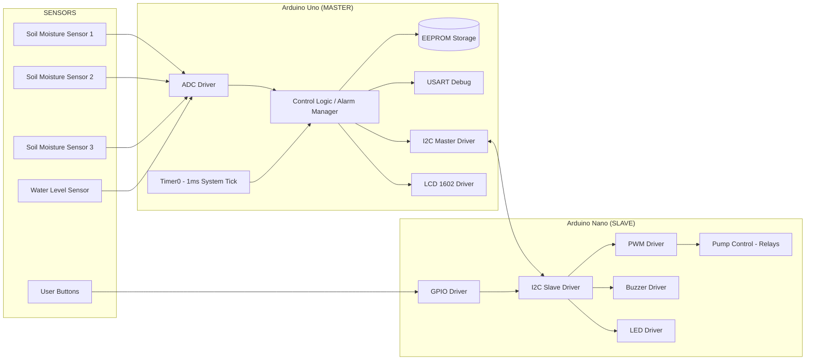

# Sistem-Automat-de-Irigare-pentru-Plante

Acest repository este dedicat dezvoltării unui sistem inteligent de irigare automatizată, conceput pentru gestionarea eficientă a udării plantelor la scară mică.

Proiectul utilizează o arhitectură de tip Master-Slave bazată pe două plăci Arduino (Arduino Uno; Arduino Nano), care colaborează pentru a monitoriza și controla în timp real umiditatea solului.
Scopul principal al sistemului este menținerea unei umidități optime a solului pentru a susține sănătatea plantelor, reducând în același timp intervenția omului.
Prin folosirea senzorilor de umiditate, a unui sistem de distribuție a apei și a unui display pentru afișarea datelor relevante, utilizatorul beneficiază de o soluție eficientă și ușor de utilizat.

Repository-ul conține codul sursă, documentația și resursele necesare pentru înțelegerea, reproducerea și extinderea acestui sistem.

## Descărcare software pentru monitorizare

[](https://github.com/razvanstefandima-11/Sistem-Automat-de-Irigare-pentru-Plante/releases/tag/1.0.1)

## Specificații

 - **Fără Librării Arduino**: Manipulare directă a regiștrilor (register manipulation) pentru control total asupra hardware-ului și eficiență maximă a resurselor.
 - **BSP (Board Support Package)**: Mapare hardware specifică pentru Arduino Uno (Master) și Arduino Nano (Slave).
 - **Drivere**: Arhitectură modulară, documentată și reutilizabilă pentru perifericele ATmega328P:

    - **GPIO:** Inițializare, Write (Pompe, LED, Buzzer), Read (Senzor Ultrasonic), Toggle (LED Alarma).
    - **Interrupts:** Gestionarea ecoului de la HC-SR04 și a comunicației I2C prin vectori de întrerupere.
    - **Timer:** System Tick de 1ms folosind Timer0 în mod CTC (pentru cronometrarea alarmei de 60s).
    - **EEPROM:** Salvarea pragurilor de umiditate (Read/Write) pentru a nu pierde setările la pană de curent.
    - **ADC:** Conversie pe 10-biți în mod blocking pentru citirea celor 3 senzori de umiditate capacitivi.
    - **I2C (TWI):** Driver pentru comunicarea Master (Uno) - Slave (Nano) și controlul display-ului LCD 1602.
    - **UART (USART):** Comunicație serială pentru debugging, monitorizare în timp real și afișarea valorilor senzorilor în Serial Monitor.
    - **LCD 1602:** Driver pentru afișarea nivelului de umiditate, stării pompelor, mesajelor de avertizare și meniului de configurare.
    - **Buzzer:** Generarea alertelor sonore pentru nivel scăzut al apei și stări critice ale sistemului.
    - **Pump Control:** Driver pentru controlul pompelor prin relee.
    - **Button/Input Driver:** Debouncing software și detectarea apăsărilor pentru navigarea prin meniul de configurare.
    - **Alarm Manager:** Gestionarea condițiilor de alarmă și sincronizarea semnalizării LED/Buzzer.
     
  - **Sistem de Build Robust**: Utilizarea Makefile pentru automatizarea proceselor de compilare, link-editare și scriere (flash) via avrdude.

## Diagrama Arhitectura



## 🔌 Conexiuni Fizice și Mapare Pini (Cablaj)

Pentru a asigura funcționarea stabilă a arhitecturii Master-Slave și a evita zgomotul electromagnetic provocat de comutația pompelor, pinii sunt mapați strict la nivel de registru bare-metal.

### 1. Nodul Master (Arduino Uno)
Gestionează achiziția de date de la senzori, interfața cu utilizatorul și trimite comenzi executive către Slave prin magistrala I2C.

| Periferic / Modul | Pin Componentă | Pin Fizic Arduino Uno | Note Hardware & Configurare |
| :--- | :---: | :---: | :--- |
| **Magistrală I2C** | SDA <br> SCL | **A4** <br> **A5** | Linie date I2C (Inter-Integrated Circuit).<br>Linie ceas I2C. *Masele plăcilor trebuie unite!* |
| **Senzori Sol** | Senzor 1 (AOUT) <br> Senzor 2 (AOUT) <br> Senzor 3 (AOUT) | **A0** <br> **A1** <br> **A2** | Intrări analogice (ADC).<br>Măsoară umiditatea în mod capacitiv (0 - 99%). |
| **Nivel Rezervor** | Senzor Apă (AOUT) | **A3** | Detectează prezența apei în bazin pentru avarie. |
| **Ecran LCD 1602** | RS <br> EN <br> D4 <br> D5 <br> D6 <br> D7 | **D12** <br> **D11** <br> **D5** <br> **D4** <br> **D3** <br> **D2** | Interfațare în mod 4 biți.<br>Contrastul (Vo) se leagă la un potențiometru sau rezistor de 1kΩ la GND. |
| **Butoane Meniu** | Buton MINUS <br> Buton SELECT <br> Buton PLUS | **D9** <br> **D10** <br> **D13** | Configurați cu **Pull-up intern** din regiștri.<br>Comută pe masă (GND) la apăsare (Logic LOW). |
| **Alerte Sistem** | LED Alarmă <br> Buzzer | **D8** <br> **D6** | Ieșiri digitale de avarie.<br>Se recomandă înserierea LED-ului cu un rezistor de 220Ω. |

### 2. Nodul Slave (Arduino Nano)
Ascultă asincron magistrala TWI/I2C la adresa `0x20` și controlează direct punțile de relee pentru acționarea hidraulică.

| Periferic / Modul | Pin Componentă | Pin Fizic Arduino Nano | Note Hardware & Configurare |
| :--- | :---: | :---: | :--- |
| **Magistrală I2C** | SDA <br> SCL | **A4** <br> **A5** | Conexiune directă cu pinii corespunzători de pe Uno. |
| **Actuatoare (Pompe)**| Releu 1 (IN1) <br> Releu 2 (IN2) <br> Releu 3 (IN3) | **D2** <br> **D3** <br> **D4** | Ieșiri digitale active pe LOW (sau HIGH, în funcție de modulul de relee folosit). |

> ⚠️ **Regulă de aur pentru cablaj:** Pinii GND (Masa) ai ambelor plăci Arduino, ai senzorilor și ai alimentării externe a pompelor trebuie să fie **conectați împreună** pentru a asigura un potențial de referință comun!
> 
> ⚠️ **STABILITATE - Rezistențe Pull-up Hardware pe I2C:**
> Deși pull-up-ul intern este activat software direct din regiștri (`PORTC |= ...`), rezistențele interne ale microcontrolerului sunt prea mari (slabe) pentru medii cu zgomot inductiv. Pentru o stabilitate maximă a semnalului, se recomandă legarea a două rezistențe fizice externe de **4.7kΩ** sau **10kΩ** (una între SDA/A4 și 5V, iar cealaltă între SCL/A5 și 5V). Acest artificiu hardware asanează complet zgomotul electromagnetic și interferențele provocate de inductanța pompelor de apă în momentul comutației releelor, prevenind blocarea magistralei TWI.

---

## Biblioteca Botanică (Praguri de Udare)

Sistemul folosește o logică de mapare procentuală inversată bazată pe calibrarea senzorilor capacitivi (`0%` - uscat complet, `99%` - imersie totală în apă). Algoritmul pornește irigarea când umiditatea scade sub pragul setat și o oprește la un nivel de `Prag + 5%` (Histerezis software pentru protecția pompelor).

Mai jos se găsesc valorile de calibrare recomandate pentru 15 plante comune din comerț:

<details>
<summary>📊 Click pentru a extinde Tabelul cu Pragurile Plantelor</summary>

| Nr. | Plantă Comună | Prag Irigare | Necesar Hidric / Comportament | Recomandare plasare senzor |
| :---: | :--- | :---: | :--- | :--- |
| **1** | Mușcată *(Pelargonium)* | **30% - 35%** | Moderat. Solul trebuie să respire între două cicluri. | Adâncime medie în ghiveci. |
| **2** | Orhidee *(Phalaenopsis)* | **15% - 20%** | Foarte scăzut. Rădăcinile au nevoie de aerisire mare. | Fixat strâns în scoarță (evitați golurile de aer). |
| **3** | Violetă Africană | **40% - 45%** | Constant moderat. Urăște contactul apei cu frunzele. | Senzor plasat la suprafață (rădăcini scurte). |
| **4** | Anthurium *(Floarea Flamingo)*| **45% - 50%** | Tropical. Sensibilă la scăderi bruște sub 40%. | Necesită sol aerat (amestec turbă/scoarță). |
| **5** | Crăciunel *(Schlumbergera)* | **25% - 30%** | Cactus de pădure. Evitați solul noroios sau argilos. | Monitorizați drenajul eficient al ghiveciului. |
| **6** | Crinul Păcii *(Spathiphyllum)*| **55% - 60%** | Ridicat. Frunzele se pleoștesc vizibil sub 50%. | Reacționează cel mai rapid la pornirea irigării. |
| **7** | Calathea *(Planta Păun)* | **55% - 60%** | Mare și constant. Marginile frunzelor se usucă la stres. | Mențineți pământul reavăn în permanență. |
| **8** | Cyclamen | **45% - 50%** | Sol mereu reavăn. Udarea la rădăcină protejează bulbul. | Direcționați furtunul de apă la baza tulpinii. |
| **9** | Begonie | **40% - 45%** | Moderat. Tulpinile cărnoase pot putrezi la băltire. | Păstrați un prag de siguranță de max. 45%. |
| **10**| Azalee *(Rhododendron)* | **60% - 65%** | Foarte ridicat. Pământul (acid) trebuie să fie ca un burete. | Uscarea completă a solului îi poate fi fatală. |
| **11**| Ficus Benjamina | **35% - 40%** | Moderat. Își pierde frunzele la șocuri hidrice extreme. | Pragul de 35% oferă stabilitatea ideală. |
| **12**| Dracaena Marginata | **25% - 30%** | Scăzut. Foarte rezistentă la perioade lungi de secetă. | Rădăcinile putrezesc ușor. Păstrați pragul jos. |
| **13**| Pothos *(Iedera Dracului)* | **30% - 35%** | Moderat. Extrem de iertătoare cu erorile de calibrare. | Ideală pentru testele de rulare ale sistemului. |
| **14**| Guzmania *(Bromelia)* | **35% - 40%** | Moderat. Rădăcinile au rol principal de fixare. | Solul se umzește doar pentru microclimat. |
| **15**| Schefflera *(Arborele Umbrelă)*| **30%** | Moderat-scăzut. Solul trebuie lăsat să se usuce la suprafață. | Dacă frunzele cad, coborâți pragul spre 25%. |

</details>

## Roadmap

- [x] GPIO driver
- [x] ADC driver
- [x] EEPROM driver
- [x] Interrupt driver
- [x] Timer driver
- [x] PWM driver
- [x] I2C driver
- [x] Lcd driver
- [x] Pompe driver
- [x] Senzor Umiditate driver
- [x] LED driver


## Structura Proiect

```
├── bsp/            # Board definitions (uno.h, nano.h)
├── drivers/        # Hardware Abstraction Layer
│   ├── adc/
│   ├── button/
│   ├── buzzer/
│   ├── eeprom/
│   ├── gpio/
│   ├── i2c/
│   ├── interrupt/
│   ├── lcd/
│   ├── led/
│   ├── nivel apa/
│   ├── pompe/
│   ├── pwm/
│   ├── s_umiditate/
│   ├── timer/
│   └── usart/
├── src/            # Application source code (main.c)
├── test/           # Unit tests & Mocks
│   ├── mocks/      # Mock AVR registers for host testing
│   ├── framework/  # Minimal test runner
│   └── test_*.c    # Unit test files
├── utils/          # Helper macros (BIT manipulations)
└── Makefile        # Build configuration
```

## Build & Flash

### Prerequisites

- `avr-gcc` toolchain
- `avrdude`
- `make`

### Comenzi
| Comanda |  Descriere  |
|---------|-------------|
| `make all`   | Compile the project. |
| `make flash` | Flash the firmware to the connected board. |
| `make clean` | Remove build artifacts. |


